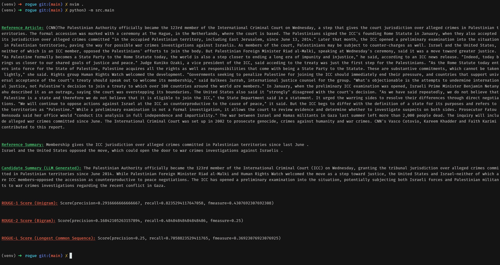

# ROGUE Benchmark Demo

### Usage
Run the following in the root directory to set up the venv and run the demo.
```bash

./init.sh

source venv/bin/activate

./init.sh

python3 -m src.main

```

Demo run:

